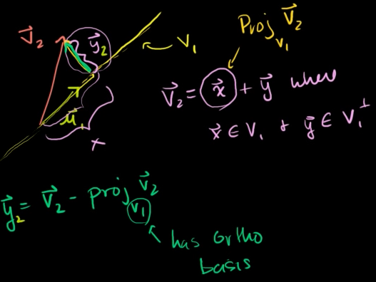

# Mikaels liste:

(observasjon av innholdet i alle eksamenene)

Oppsummering alle eksamener: 5-6 oppgaver med deloppgaver.

1. Handler om konvertering av tall - binære, heksadesimale, desimale, og IEEE-flyttall med halv/enkel/dobbel presisjon
2. PA=LU faktorisering med forskjellige metoder eks Gauss-Seidel iterasjon
3. Interpolering av punker av forskjellig grad.
4. Iterative utregninger(Polynom, interpolering, minste kvadraters metode,  trigonometrisk polynom, potensiterasjon, invers potensiterasjon med skift)
   Bezierkurven med startpunkt,
5. Denne var variert litt mer enn de andre oppgavene.
   Fouriertransformasjon, Jacobimatrisen, Gauss-Newton,
6. Egenverdi konvergerer potensmetoden, konvergensrate, inverse potensmetoden

# 0 Grunnleggende saker

Stuff som typisk dukker opp i oppgave 1.

## 0.1 basically bare Horners metode

$${\color{blue}2}(x-1)^2x + {\color{red}3}(x-1)x + {\color{purple}50}x - 4 = (({\color{blue}2}(x-1) + {\color{red}3})(x-1) + {\color{purple}50})x - 4$$

## 0.2 hex, bin, desi

Brøk til hex? Se på dette:
$$\frac{2}{3} \cdot 16 = 10 + \frac{2}{3}$$
$$\frac{2}{3} \cdot 16 = 10 + \frac{2}{3}$$
$$\vdots$$
Samme type metode som for binærtall.

Hex til desi men med desimaler?
Ikke få panikk: $(0.F)_{16} = \frac{15}{16}$ osv.

## 0.3 Flyttall

Lett formel fra LF for **float** (enkelpresisjon):

$$(-1)^s \cdot 2^{e-127} \cdot \left(1 + \frac{m}{2^{23}}\right)$$

Dette lagres som $(s|e|m)$.

Generell bias: $2^{n-1}-1$ der $n$ er antall bits eksponenten lagres med.

(PS: ikke miks 23 og 32 som en annen gjøk. det går dårlig.)

$$
\begin{tabular}{ |l|c|c|c| }
    \hline
    {\bfseries Presisjon} &
    {\bfseries Fortegn} &
    {\bfseries Eksponent} &
    {\bfseries Mantisse} \\
    \hline
    enkel (float) & 1 & 8 & 23 \\
    dobbel & 1 & 11 & 52 \\
    lang dobbel & 1 & 15 & 64 \\
    \hline
\end{tabular}
$$

## 0.4 Tap av signifikans

Begrepet i overskriften:
$234.516$ inn, $0.004$ ut $\rightarrow$ tap av 5 signifikante sifre.

Vi vil spesielt unngå å trekke to veldig like tall fra hverandre.

For disse oppgavene: Husk trikset med å gange med konjugatet til uttrykket. Da kommer tredje kvadratsetning (konjugatsetningen) inn i bildet og ting blir mycket betre.
$$\sqrt{1+\epsilon} - \epsilon = \frac{\sqrt{1+\epsilon} - \epsilon}{1} \cdot \frac{\sqrt{1+\epsilon} + \epsilon}{\sqrt{1+\epsilon} + \epsilon}$$

abc-formelen kan restruktureres i tilfeller der $a$ og $c$ er betydelig mindre enn $b$:
$\pm \rightarrow +$ hvis $b > 0$, $\pm \rightarrow -$ hvis $b < 0$.
$$x_1 = - \frac{b \pm \sqrt{b^2 - 4ac}}{2a}$$
$$x_2 = - \frac{2c}{b \pm \sqrt{b^2 - 4ac}}$$

Vi vil oppnå å _kun_ addere tall med _samme_ fortegn (altså ikke subtrahere potensielt veldig like tall, som $b$ og $\sqrt{b^2-4ac}$ typisk blir hvis $4|ac| \ll b^2$)

Uttrykket for $x_2$ er avledet ved å gange med konjugatet $\sqrt{b^2 +4ac}$

Ser at LF gjør det _manuelt_ og ikke bare sier "her er en god formel."
Kan være et eksempel til etterfølgelse

## 0.5 Ting fra calculus

# 1 Likningsløsning

## 1.1 Halveringsmetoden

Skjæringssetningen $\rightarrow$ f(a) og f(b) må ha forskjellig fortegn for at det skal være en rot mellom dem.

Denne metoden $\approx$ binærsøk:

1. Intervall $[a,b]$
2. Midtpunkt $c$
3. Hvilken side av $c$ ligger roten på? $f(a), f(c), f(b)$
4. Tilbake til 2 inntil ønsket $|b-a|<\text{nøyaktighet}$ er nådd.

## 1.2 Fikspunktiterasjon

hei der

Fikspunkt: $f(c)=c$

Men vi vil ha alle $r$ slik at $f(r)=0$

Kan sette $f(x)=x$ eller løse $f(x)$ med hensyn på _ett_ $x$-ledd.

Finner fikspunktene til den nye likningen.  
De er da røttene til $f(x)$.

### Konvergens

Hvis $f(x)$ er kontinuerlig deriverbar, $f(r)=r$ og $|f'(r)| = S<1$:  
Da konvergerer $x_{n+1} = f(x_n)$ med rate $S$ for $x_0$ nære $r$

## 1.3 Begrensninger for nøyaktighet

Iterasjonsmetoder for å finne rot $r$ av $f(x)$

Foroverfeil: $|x_i - r|$  
Bakoverfeil: $|f(x_i) - f(r)| = |f(x_i)|$ gir hvor langt $f(x_i)$ er fra null ($f(r)=0$)

Feilforstørringsfaktor = relativ foroverfeil / relativ bakoverfeil
$$\left|\frac{\Delta r / r}{\epsilon}\right| = \left|\frac{g(r)}{r f'(r)}\right|$$

### Kondisjon

kondisjontall
: største feilforstørringsfaktor

velkondisjonert
: kondisjontall nært 1

dårlig kondisjonert
: stort kondisjontall

Et eksempel med $\epsilon_{mach}$ ganget med en $g(x)$

## 1.4 Newtons metode

Velg start $x_0$  
La $x_{n+1} = x_n - \frac{f(x_n)}{f'(x_n)}$

### Kvadratisk konvergens

Metode med foroverfeil  
$e_n = |x_n - r|$

Kvadr. konv. hvis  
$$\lim_{n\rightarrow\infty}{\frac{e_{n+1}}{e_n^2}} < \infty$$

Newtons metode er kvadr. konv. hvis

+ $f(r)=0$
+ $f'(r)\ne0$
+ $f(x)$ er 2x kontinuerlig deriverbar

Da har vi følgende konvergens:
$$\lim_{n\rightarrow\infty}{\frac{e_{n+1}}{e_n^2}} < M$$
$$M = \left|\frac{f''(r)}{2f'(r)}\right|$$
Omskrevet: $e_{n+1} \approx M e_n^2$

### Rot med multiplisitet

Rot med multiplisitet $m$ har konvergens $S = (m-1)/m$

Metoden endres: $x_{n+1} = x_n - \frac{m f(x_n)}{f'(x_n)}$

Kvadratisk konvergens mot $r$.  
(krever at vi vet multiplisitet? ummmm what?)

## 1.5 Sekantmetoden et al.

To startverdier $x_0$ og $x_1$.  
De neste blir
$$x_{n+1} = x_n - \frac{f(x_n)(x_n - x_{n-1})}{f(x_n) - f(x_{n-1}}$$
og vi avslutter før $f(x_n)=f(x_{n-1})$ for å unngå divisjon med null

### Konvergens

Litt saktere enn Newton.
$$e_{n+1} \approx \left|\frac{f''(r)}{2f'(r)}\right| e_n e_{n-1} \\
\approx \left|\frac{f''(r)}{2f'(r)}\right| e_n^{1.6180}$$

### Andre

Regula Falsi
: variant av halveringsmetoden

Mullers metode
: A la sekant men med parabel istedenfor rett linje,
  færre iterasjoner men mer kostbar pga. kvadratisk likning

Invers kvadratisk interpolasjon
: Invers parabel istedenfor rett linje.
  Færre iterasjoner enn sekant og raskere enn Mullers


# 2 Likningssystemer

## 2.1 Gauss-eliminasjon

blah blah

Vi konkluderer med at gaussing av $n \times n$ krever
$\frac{2}{3}n^3 + \frac{1}{2}n^2 - \frac{7}{6}n$
operasjoner
og tilbakeinnsetting krever $n^2$

## 2.2 LU-faktorisering

Øvre triangulær:
$$
\begin{bmatrix}
a & b & c \\
0 & d & e \\
0 & 0 & f \\
\end{bmatrix}
$$
Nedre triangulær:
$$
\begin{bmatrix}
a & 0 & 0 \\
b & c & 0 \\
d & e & f \\
\end{bmatrix}
$$

Introduserer notasjon for $L$-matriser:
$$
L_{12}(c_1) = 
\begin{bmatrix}
1 & 0 & 0 \\
c_1 & 1 & 0 \\
0 & 0 & 1 \\
\end{bmatrix}
$$
Som videre gir at:
$$
L_{12}(c_1)L_{13}(c_2)L_{23}(c_3) = 
\begin{bmatrix}
1 & 0 & 0 \\
c_1 & 1 & 0 \\
c_2 & c_3 & 1 \\
\end{bmatrix}
$$
...og som likningsløsning:
$$
\begin{aligned}
A &= LU \\
\begin{bmatrix}
1 & -1 & 3 \\
1 & 1 & 1 \\
2 & 4 & 4 \\
\end{bmatrix}
&=
L_{12}(1)L_{13}(2)L_{23}(3)
\begin{bmatrix}
1 & -1 & 3 \\
0 & 2 & -2 \\
0 & 0 & 4 \\
\end{bmatrix}
\\
&=
\begin{bmatrix}
1 & 0 & 0 \\
c_1 & 1 & 0 \\
c_2 & c_3 & 1 \\
\end{bmatrix}
\begin{bmatrix}
1 & -1 & 3 \\
0 & 2 & -2 \\
0 & 0 & 4 \\
\end{bmatrix}
\end{aligned}
$$

**NB**: Alle $c_i$ skal være negativ versjon av tallet raden ble multiplisert med.

Tilbakeinnsetting:
$$
\begin{aligned}
Ax &= b \\
LUx &= b \hspace{2em} \left(\frac{2}{3}n^3\right)\\
Lc &= b \hspace{2em} (n^2)\\
Ux &= c \hspace{2em} (n^2)
\end{aligned}
$$

Største bonus: LU-faktorisering gjøres én gang, så følger flere tilbakeinnsettinger.

## 2.3 Feilkilder

noe om foroverfeil og bakoverfeil
og feilforstørringsfaktor og kondisjontall

Normer, feil, kondisjonering, swamping...

Alt dette sto i det tapte sammendraget.

Men vet du meg hva? Det lå i matlab-repoet! Hallelujah!

### Vector norms

$$||x||_p = \sqrt[p]{|x_1|^p + \cdots + |x_n|^p}$$

$$||x||_1 = |x_1| + \cdots + |x_n| = \text{abs.verdi av alle elementene}$$

$$||\bold{x}||_{\infty} = \max|x_i|, i = 1,\dots,n = \text{maksimalt element}$$

### Matrix norms

$$||A||_1 = \text{maksimal kolonnesum}$$

$$||A||_{\infty} = \text{maximal absolute row sum} = \text{maksimal radsum}$$

### Errors

For a system $A \bold x = \bold b$ with approximate solution $\bold x_a$, we have:

#### Backward error

$$||\bold{b} - A\bold{x_a}||_{\infty}$$

#### Forward error

$$||\bold{x} - \bold{x_a}||_{\infty}$$

#### Residual

$$r = b - Ax_a$$

#### Relative backward error

$$\frac{||\bold{r}||_{\infty}}{||\bold{b}||_{\infty}} = \frac{||\bold{b} - A\bold{x_a}||_{\infty}}{||\bold{b}||_{\infty}}$$

#### Relative forward error

$$\frac{||\bold{x} - \bold{x_a}||_{\infty}}{||\bold{x}||_{\infty}}$$

#### Error magnification error

$$\frac{\text{relative forward error}}{\text{relative backward error}}$$

#### Condition number

The condition number is the largest error magnification factor (feilforstørringsfaktor)

$$cond(A) = ||A||_{\infty} \cdot ||A^{-1}||_{\infty} = ||A|| \cdot ||A^{-1}||$$


## 2.4 $PA = LU$-faktorisering

Swamping kan forhindres med _delvis pivotering:_  
Bytt om på rader for å få største mulige pivotelementer

Hvordan gjøre dette med matriser?  
Vi introduserer _permutasjonsmatriser!_  
De er modifiserte identitetsmatriser med ombyttede rader, lagd for å bytte om på rader.

Lag en $P$ ved å utføre radbyttene som gjøres i gausseliminasjonen på en identitetsmatrise.

Løser så:
$$
\begin{aligned}
Ax &= b \\
PAx &= Pb \\
LUx &= Pb \\
Lc &= Pb \\
Ux &= c
\end{aligned}
$$

## 2.5 Iterative metoder

Diagonaldominant: Elementene langs hoveddiagonalen har størst absoluttverdi blant elementene på sin egen rad. _De er heller ikke lik 0._

### Jacobi

Løs første likning for første variabel, andre likning for andre variabel osv.
Start med en startverdi for hver variabel og oppdater dem med likningene.

$$x_1 = \frac{b_1 - c_{1,2}x_2 - c_{1,3}x_3 - \cdots - c_{1,n}x_n}{c_{1,1}}$$

Må ha diagonaldominant matrise for å konvergere, siden det gir en større nevner $c_1$ enn komponentene i telleren kan utgjøre.

Som matriser: $L$ er nedre triangel, $U$ er øvre, $D$ er hoveddiagonalen.

$$
\begin{aligned}
Ax=(D+L+U)x &= b \\
         Dx &= b - (L+U)x \\
          x &= D^{-1}(b - (L+U)x) \\
\end{aligned}
$$

### Gauss-Seidel

Bruker nye verdier _umiddelbart_. Konvergerer raskere. Trenger fortsatt diagonaldominant matrise.

## 2.7 Newtons metode for flere variable

Doktor Jacobis fantastiske matrise $^{\text{TM}}$

For likningssett $F = { f_1(x,y), f_2(x,y) }$:
$$
DF(x,y)
=
\begin{bmatrix}
\frac{\delta f_1}{\delta x} & \frac{\delta f_1}{\delta y} \\
\frac{\delta f_2}{\delta x} & \frac{\delta f_2}{\delta y}
\end{bmatrix}
$$

Taylor for det her:
$$F(x) = F(x_0) + DF(x_0)(x-x_0) + O(x-x_0)^2$$
Vi gjør det lineært og bryr oss ikke om $O(x^2)$.

Metoden bruker startvektor $x_0$ og kunne gått slik:
$$x_{k+1} = x_k - (DF(x_k))^{-1} F(x_k)$$
\- men vi gjør et triks for å slippe invers:

Vi løser
$$DF(x_k)s = -F(x_k)$$
og setter inn i 
$$x_{k+1} = x_k + s$$

### Gauss-Seidel

ok jeg gidder ikke skrive ned dette...
det er masse stuff anyway, se side 134-135 for Broyden I og II


# 3 Interpolasjon

Gjennom $n$ punkter med _forskjellige_ $x$-verdier, går det _ett og bare ett_ polynom av grad $n-1$ eller lavere.

Interpolasjon gir en funksjon som stemmer eksakt med inndata  
-- $f(t_i) = x_i$ for alle datapunktene.

## 3.1 Newtons dividerte differanser

Relevant: Et sett med $n$ punkter kan interpoleres av _ett og bare ett_ polynom av grad $n - 1$.

Dessuten: Et $n$-tegrads polynom har maksimalt $n$ røtter hvis det ikke er $f(x)=0$

Lagrange-interpolasjon er noe av det samme. Se i boka eller noe.

Definisjonen av dividert differanse:
$$f[x_k] = f(x_k)$$
$$f[x_k,\dots,x_{k+r}] = \frac{f[x_{k+1},\dots,x_{k+r}] - f[x_{k},\dots,x_{k+r-1}]}{x_{k+r} - x_k}$$

Trekanten vi setter opp:
```
f[x1] f[x1 x2] f[x1 x2 x3]
f[x2] f[x2 x3]
f[x3]
```

Dette eksempelet gir polynomet
$$P_3(x) = f[x_1] + f[x_1,x_2](x-x_1) + f[x_1,x_2,x_3](x-x_1)(x-x_2)$$
og generelt finner vi koeffisientene langs øvre side av trekanten, fra konstantledd til $n-1$-tegradsledd.

Omskriv polynomet med Horners metode for mer effektiv utregning.

## 3.2 Interpolasjonsfeil

### Faktisk feil

$P(x)$ interpolerer $f(x)$ i $x_1,\dots,x_n$, da er feilen i $x$
$$f(x)-P(x) = \frac{(x-x_1)(x-x_2)\cdots(x-x_n)}{n!} f^{(n)}(c)$$
for en $c$ som er $\min(x_i) < c < \max(x_i)$

### Estimat

Feilestimat for interpolering $P(x)$ av en $f(x)$ definert på $[a,b]$ -- med en $M$ slik at $|f^{(n)}(x)|<M$ for alle $x\in[a,b]$
$$|f(x)-P(x)| < \left|\frac{(x-x_1)(x-x_2)\cdots(x-x_n)}{n!}\right| M$$

og dessuten: Chebyshev fikser sakene ved å sample m/forskjellig avstand mellom punktene!

## 3.4 Kubiske splines

### Egenskaper for alle splines:

1. $S_i(x_i) = y_i$ og $S_i(x_{i+1})=y_{i+1}$ for $i=1,\dots,n-1$  
   -- altså går kurven gjennom og interpolerer alle datapunktene!
2. $S'_{i-1}(x_i) = S'_i(x_i)$ for $i=2,\dots,n-1$  
   -- altså blir tangentene til de indre endene av hver motstøtende spline overensstemmende, slik at vi får en jevn kurve.
2. $S''_{i-1}(x_i) = S''_i(x_i)$ for $i=2,\dots,n-1$  
   -- altså gjelder det samme for krummingen av splinene.

Disse gir ingen _entydig_ definisjon, vi trenger noe ekstra for å få et løsbart likningssett.

### Noen sett med endepunktsregler:

naturlig spline:
: $S''_1(x_1) = 0$ og $S''_{n-1}(x_n) = 0$  
  -- altså skal det være et vendepunkt (inflection point) på hver side av kurven.

krumningsjusterte splines:
: $S''_1(x_1) = 2c_1 = k_1$ og $S''_{n-1}(x_n) = 2c_n = k_n$  
  -- altså skal hver ende ha en definert krumning

låste splines:
: $S'_1(x_1) = \delta_1(2c_1 + c_2) = v_1$ og $S'_{n-1}(x_n) = \delta_{n-1}(c_{n-1} + 2c_n) = v_n$

parabler i endene:
: Kontrollerte tredjederiverte: $d_1=0$ og $d_{n-1}=0$  
  som tilsvarer at $c_1=c_2$ og $c_{n-1}=c_n$

not-a-knot:
: Sørge for at $S_1(x)=S_2(x)$ og $S_{n-2}(x)=S_{n-1}(x)$ ved at $d_1=d_2$ og $d_{n-2}=d_{n-1}$

Hva første og siste rad byttes ut med? Eh, jeg gidder ikke.

## 3.5 Bezierkurver

Formel fra forelesning:
$$P(t) = (1-t)^3P_1 + 3t(1-t)^2P_2 + 3t^2(1-t)P_3 + t^3P_4$$

**NB: De parameteriserte likningene gjelder fra 0 til 1...**  
(it could have been so much simpler)

Følgende egenskaper gjelder:

Start og slutt i start- og sluttpunktene, naturligvis.
$$
\begin{aligned}
P(0) &= P_1
P(1) &= P_4
\end{aligned}
$$

De førstederiverte i start og slutt er gitt av kontroll- og endepunkt:
$$
\begin{aligned}
P'(0) &= 3(P_2 - P_1) \\
P'(1) &= 3(P_4 - P_3)
\end{aligned}
$$
Altså skal kurven tangere linjene gjennom endpunkt og kontrollpunkt.

Vi har fra disse egenskapene **eksplisitte formler** for kontrollpunktene:
$$
\begin{aligned}
P_2 = P_1 + \frac{1}{3}P'(0) \\
P_3 = P_4 + \frac{1}{3}P'(1)
\end{aligned}
$$
Sammenhengen burde vært åpenbar, men nei da.

Koeffisientene kan finnes såher:
$$
\begin{aligned}
b_x &= 3(x_2 - x_1) \\
c_x &= 3(x_3 - x_2) - b_x \\
d_x &= x_4 - x_1 - b_x - c_x \\
b_y &= 3(y_2 - y_1) \\
c_y &= 3(y_3 - y_2) - b_y \\
d_y &= y_4 - y_1 - b_y - c_y
\end{aligned}
$$

Parameterisert for $t \in [0, 1]$:
$$
\begin{aligned}
x(t) = x_1 + b_xt + c_xt^2 + d_xt^3 \\
y(t) = y_1 + b_yt + c_yt^2 + d_yt^3
\end{aligned}
$$

# 4 Minste kvadraters metode

Her skal vi få _tilpasninger_ som ikke er begrenset av kravet til likhet som i interpolasjon.

## 4.1 Minste kvadraters metode

Gitt
$$\begin{aligned}Ax &= b\end{aligned}$$
løs
$$\begin{aligned}A^T A \overline x &= A^T b\end{aligned}$$

Her interpolerer vi ikke, vi skaffer en «best fit» til datapunktene

### Modellere data

Tilpasse en lineær modell $y = c_1 + c_2 t$ til $(x_i, y_i)$.  
$\rightarrow$ da er $b$-vektoren $y$-verdiene og $A$-matrisen slik:
$$
\begin{bmatrix}
1 & x_0 \\
1 & x_1 \\
1 & x_2 \\
\vdots & \vdots \\
1 & x_n
\end{bmatrix}
$$
...som gir systemet
$$
\begin{bmatrix}
1 & x_0 \\
1 & x_1 \\
\vdots & \vdots \\
1 & x_n
\end{bmatrix}
\begin{bmatrix}
c_1 \\
c_2 \\
\end{bmatrix}
=
\begin{bmatrix}
y_0 \\
y_1 \\
\vdots \\
y_n
\end{bmatrix}
$$
og videre
$$
\begin{bmatrix}
1 & 1 & \cdots & 1 \\
x_0 & x_1 & \cdots & x_ n
\end{bmatrix}
\begin{bmatrix}
1 & x_0 \\
1 & x_1 \\
\vdots & \vdots \\
1 & x_n
\end{bmatrix}
\begin{bmatrix}
c_1 \\
c_2 \\
\end{bmatrix}
=
\begin{bmatrix}
1 & 1 & \cdots & 1 \\
x_0 & x_1 & \cdots & x_ n
\end{bmatrix}
\begin{bmatrix}
y_0 \\
y_1 \\
\vdots \\
y_n
\end{bmatrix}
$$
Dette løses så for $c_1$ og $c_2$, da har vi linja.

### Feil

Feilvektoren:
$$r = b - A \bar x$$

Squared error (kvadratet av lengden):
$$\text{SE} = (||r||_2)^2 = r_1^2 + \cdots + r_m^2$$

Root mean squared error (lengden delt på $\sqrt{m}$):
$$\text{RMSE} = \sqrt{\frac{\text{SE}}{m}} = \sqrt{\frac{r_1^2 + \cdots + r_m^2}{m}}$$

## 4.2 Diverse modeller

### Periodisk

$$y = a \sin \frac{2\pi x}{p} + b \cos \frac{2\pi x}{p} + c$$

### Eksponentiell

$$y = ae^{bx}$$

ln på begge sider:

$$\ln y = \ln a + bx$$

Får lineære likninger for $\ln a$ og $b$  
\- finner $a$ med $a = e^{\ln a}$

### Potensmodell

$$y = ax^b$$

Samme triks som for eksponentiell:
$$\ln y = \ln a + b \ln x$$

og samme $a = e^{\ln a}$

## 4.3 QR-faktorisering

Okay, it's simpler than it looks.

Vi faktoriserer $A = QR$ der $Q$ er ortogonal og $R$ er øvre triangulær.
Det betyr at $Q^TQ=I$.

Altså: vi vil finne enhetsvektorer $q_i$ som alle står vinkelrett på hverandre (er parvis ortogonale $\rightarrow$ utgjør en ortogonal basis) og kan faktorisere $A$ på denne formen.

### Gram-Schmidt

$m \times n$-matrise $A$ som:
$$A = \left[a_1|a_2|\cdots|a_n\right]$$

Lager ortonormal basis slik:
$$
\begin{aligned}
q_1 &= a_1 / |a_1| &\text{normaliserer $a_1$} \\
w_2 &= a_2 - (a_2^Tq_1)q_1 &\text{trekk fra projeksjonen av $a_2$ i retning $q_1$} \\
q_1 &= w_2 / |w_2| &\text{normaliserer nå $w_2$ for å få ortogonal vektor $q_2$} \\
&\dots \\
w_n &= a_n - (a_n^Tq_1)q_1 - \cdots - (a_n^Tq_{n-1})q_{n-1}
&\text{trekk fra proj. av $a_n$ til alle tidl. $q$} \\
q_n &= w_n / |w_n| &\text{normaliserer forrige $w$ for å få $q$} \\
\end{aligned}
$$



Merk at kryssproduktet $(a_2 \cdot q_1)$ gir lengden av $a_2$ om den er projisert ned på $q_1$, og å gange denne lengden med $q_1$ igjen gir selve projeksjonen.

$\text{span}(q_1,q_2,a_3)=\text{span}(q_1,q_2,q_3)$ som er vektorrommet utspent av $q_{1..3}$

### Hvordan

Gram-Schmidt omskrevet til en summering av projeksjonene av $a_i$ på $q_1,\cdots,q_i$?

$$
\begin{aligned}
a_1 &= |a_1|q_1 \\
a_2 &= (a_2^Tq_1)q_1 + |w_2|q_2 \\
   &\cdots \\
a_n &= (a_n^Tq_1)q_1 + (a_n^Tq_2)q_2 + \cdots + (a_{n-1}^Tq_{n-1})q_{n-1} + |w_n|q_n \\
\end{aligned}
$$

ved å bruke omskrivingene
$r_{jj} = ||w_j||_2$ og
$r_{ij} = ||q_i^Ta_j||_2$
kan vi si at

$$
A =
\left[q_1|q_2|\cdots|q_m\right]
\begin{bmatrix}
r_{11} & r_{12} & \cdots & r_{1n} \\
0   & r_{22} & \cdots & r_{2n} \\
\vdots & \vdots & \ddots & \vdots \\
0   & 0 & \cdots & r_{nn} \\
0   & 0 & \cdots & 0 \\
\vdots & \vdots & & \vdots \\
0   & 0 & \cdots & 0 \\
\end{bmatrix}
= QR
$$

### I minste kvadraters kontekst

Vi vil minimere $||A\vec x - \vec b||_2$ som blir $||QR\vec x - \vec b||_2$.

Det er det samme som $||Q^TQR\vec x - Q^T \vec b||_2 = ||R\vec x - Q^T \vec b||_2$.

For ortogonale matriser er $||Q\vec x||_2 = ||\vec x||_2$, ${\color{red}\text{så vi slipper noe av utregningen?}}$

### Hvorfor QR?

$A$ dårlig kondisjonert $\rightarrow$ $A^TA$ er trolig enda dårligere.

$R\vec x = Q^T\vec b$ bedre kondisjonert enn $A^TA\vec x = A^T\vec b$

### Householder

Let's say that vektorene $x,w$ er slik at $||x||_2 = ||w||_2$ og la $v=w-x$.  
Vi har at siden de er av lik lengde så vil $w + x \bot w - x = v$.

Vi lager oss en $P = \frac{vv^T}{v^Tv}$ som tilfredsstiller $P^2=P$ og projiserer en $u$ ned på $v$ ved $Pu$.

(en ting å gjøre: sett $H = I - 2P$ som gir at $Hx = x -2Px$ og løs den)

**Da er $H = I - 2\frac{vv^T}{v^Tv}$ en symmetrisk ortogonal matrise og $Hx=w$.**  
(som følge av dét blir $H=H^{-1}$)

Altså: finner et slikt husholdningsapparat ved å

1. Sette $v = w - x$
2. Definere $P = \frac{vv^T}{v^Tv}$
3. Finne $H = I - 2P$

Enkelt nok, I suppose

### Householder-kjede som Q

Vi starter med første kolonnevektor $x_1$.  
$w$ velges som en vektor langs første koordinatakse av samme lengde som $x_1$:  
$$w = \pm [||x_1||_2, 0, \dots, 0]^T$$

Så finner vi $H_1$ slik at $H_1x_1 = w$ -- og sånn går nu dagan. Neste vektor blir $1$ mindre i lengde, neste husholdningsapparat blir $1$ mindre langs begge sider.

Får til slutt $A = H_1H_2H_3R = QR$, en alternativ måte å finne $Q$.

## 4.5.1 Gauss-Newton

Vi trenger noe når vi ikke har lineære likningssett  
\- Newton trår til igjen!

### Metoden

Minimere
$$r_1(x)^2 + \cdots + r_m(x)^2$$
der $r_i(x)$ er ikke-lineære likninger i flere variable

Feilen vi vil minimere er $E(x) = \frac{1}{2}r^Tr$  
\- som gjør at vi setter $F(x) = \nabla E(x) = 0$ og får at
$$r(x)^T Dr(x) = 0$$

Dette fører somehow til metoden.

**merk at $Dr(x)$ er det vi ville skrevet som $DF(x)$**

For $k=0,1,2,\dots$:
$$
\begin{aligned}
A &= Dr(x_k) \\
A^TAv_k &= -A^Tr(x_k) \\
x_{k+1} &= x_k + v_k
\end{aligned}
$$

# 10 Trigonometrisk interpolasjon

## 10.1 Fourier-transformasjon

### Enhetsrøtter

(enhetssirkelen oppdelt i $n$ sirkelbuer)

$n$-te enhetsrot blir:
$$\omega = e^{-i 2\pi / n}$$

Husk Eulers formel:
$$e^{ix} = \cos x + i \sin x$$

### DFT

$$y_k = \frac{1}{\sqrt n} \sum_{j=0}^{n-1}{x_j \omega^{jk}}$$

$$
F_n = \frac{1}{\sqrt n} 
\begin{bmatrix}
h & v & i & s \\
  & d & u &   \\
g & i & d & d
\end{bmatrix}
$$

DFT av en vektor: $y = F_n x$

Invers: $x = F_n^{-1} y$ der $F_n^{-1} = \overline{F_n}$ (kompleks konjugat)  
$\rightarrow$ så inversen er simpelthen fylt med $\omega^{-jk}$

### FFT

Splitter opp større $F_n$ i mindre komponenter for å slippe en del av beregningene.
Bruker toerpotenser.

## 10.2 Trigonometrisk interpolasjon

Utgangspunkt: Vektorene $\vec t = [t_0 t_1 \cdots t_{n-1}]^T$
og $\vec y$.

Vi interpolerer på intervallet $[c,d]$ der $c=t_0$ og $d=t_{n}$ som er ett steg etter siste verdi i oppgitt vektor. Den trigonometriske funksjonen repeterer seg selv med periode $n$.

Formlene er lange, men går ut fra en omskriving av $y = F_nx$:
$$x_j = \frac{1}{\sqrt n} \sum_{k=0}^{n-1} {y_k (\omega^{-k})^j}$$
og at $\omega = e^{-i2\pi / n}$

## 10.3

### 10.3.1 Ortogonalitet og interpolasjon

### 10.3.2 Minste kvadraters metode: Trigonometry Edition

something something vi minimerer kvadratisk feil $\sum (x_k - P_m(t_k))^2$

se bok og foilder I guess

# 12 Egenverdier

## 12.1 Potensiterasjon

### Metoden

Konvergerer mot dominant egenvektor og -verdi.

1. Normaliser vektor: $u_i = \frac{x_i}{||x_i||_2}$
2. Gang $A$ med denne: $x_{i+1} = Au_i$
3. så får du en $\lambda_{i+1} = u_i^T Au_i = u_i^T x_{i+1}$
3. og så videre

### Invers

1. Normaliser vektor: $u_i = \frac{x_i}{||x_i||_2}$
2. Bruk kvotienten: $\lambda_i = u_i^T A u_i$ (øvre del av brøken)
3. Løs $(A-sI)x_{i+1} = u_i$
4. så får du $\lambda_{i+1} = u_i^T x_{i+1}$
5. og så videre

### Rayleigh-versjonen

Rayleigh-kvotient:
$$\lambda = \frac{x^TAx}{x^Tx}$$

(pga. minste kvadrat-stuff)

Utgangspunkt i _invers_ potensiterasjon, går som følger for $i=0,1,2,\dots$:

1. Normaliser vektor: $u_i = \frac{x_i}{||x_i||_2}$
2. Bruk kvotienten: $\lambda_i = u_i^T A u_i$ (øvre del av brøken)
3. Løs $(A-\lambda_i I)x_{i+1} = u_i$

### Konvergens

Sorterer egenverdiene til $A$ slik:
$$|\lambda_1| > |\lambda_2| \ge |\lambda_3| \ge \cdots \ge |\lambda_m|$$
Altså er største egenverdi $\lambda_1$ og minste $\lambda_m$.

**Vanlig potensiterasjon:**  
Mot $\lambda_1$ med rate $S=|\lambda_2 / \lambda_1|$  
Raten blir slik pga. likningen for iterasjon $k$ (delt på $\lambda_1$):
$$\frac{A^kx_0}{\lambda_1^k} = c_1v_1 + c_2 \left({\color{red}\frac{\lambda_2}{\lambda_1}}\right)^k v_2 + \cdots$$

**Invers (med $A^{-1}$):**  
Mot $\lambda_m^-1$ som gir oss $\lambda_m$

**Invers med skift:**  
Skift $s$ gir $A - sI$ med egenverdier $\lambda_i - s$ og _like_ egenvektorer.  
Dette fordi
$$
\begin{aligned}
Av &= \lambda v \\
(A - sI) v &= (\lambda - s) v
\end{aligned}
$$
når vi trakker $sIv$ fra den opprinnelige likningen
Konvergens mot egenverdien som er _nærmest_ skiftet $s$ (_ikke_ $|s|$).  
Dette blir $\min|\lambda_i - s|$ pga. at det er _invers_ potensiterasjon.

## 12.2 QR-agoritmen

### normalisert simultaniterasjon eller noe

bla bla bla finne alle egenverdiene samtidig aka potensiterasjon i parallell

somehow kan vi sette $\overline{Q}_0 = I$ og kjøre på med
$$A\overline{Q}_j = \overline{Q}_{j+1} R_{j+1}$$
for $j=1,2,3,\dots$ så lenge vi gidder. Slik blir kolonnene i $\overline{Q}_j$ er tilnærmede egenvektorer og diagonalelementene $r_{11}^j,\dots,r_{mm}^j$ blir tilnærmede egenvedier.

### konvergens av denne

eh.

### Ekte Schur-form osv.

en matrise er på **ekte Schur-form** hvis den stort sett er øvre triangulær m/unntak av $2\times2$-kvadrater langs hoveddiagonalen.

$$
\begin{bmatrix}
x&x&x&x&x&x \\
&x&x&x&x&x \\
&&{\color{blue}x}&{\color{blue}x}&x&x \\
&&{\color{blue}x}&{\color{blue}x}&x&x \\
&&&&x&x \\
&&&&&x \\
\end{bmatrix}
$$

Et annet teorem: $A$ har reelle elementer. Da fins en ortogonal matrise $Q$ og en matrise på ekte Schur-form slik at $A = Q^TTQ$

Vi skifter, gjør $QR$-faktorisering, skifter tilbake.
$$
\begin{aligned}
A_0 - sI &= Q_1R_1
     A_1 &= R_1Q_1 + sI
\end{aligned}
$$


### Øvre Hessenberg-form

da er $a_{ij} = 0$ for $i>j+1$
$$
\begin{bmatrix}
x&x&x&x&x&x \\
x&x&x&x&x&x \\
&x&x&x&x&x \\
&&x&x&x&x \\
&&&x&x&x \\
&&&&x&x \\
\end{bmatrix}
$$

Vi vil erstatte $A$ med en $A'$ som er på øvre Hessenberg-form, siden det da blir lettere å finne $Q$ -- Householder to the resque.

(inn med Householder)

utnytter noe med at bla bla

$$H_3H_2H_1AH_1^TH_2^TH_3^T = H_3H_2H_1A(H_1H_2H_3)^T = QAQ^T$$

for $n \times n$-matrise $A$ trenger vi $n-2$ husholdninger og dette er ikke en skrivefeil
